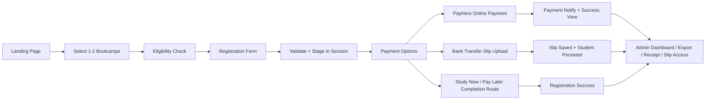

# 🎓 CCA Offer Student Onboarding

<div align="center">

<div align="center">
  
  <br/><br/>
  
</div>

[](https://github.com/codezelat/cca-offer-student-onboarding)
[](https://codezela.com)
[](https://nextjs.org/)
[](https://react.dev/)
[](https://www.typescriptlang.org/)
[](https://www.prisma.io/)
[](https://tailwindcss.com/)
[](https://vitest.dev/)
[](LICENSE)
[](https://codezela.com)

**A production-oriented student registration, payment, and admin operations system for CCA special-offer bootcamp onboarding.**

</div>

---

<a id="overview"></a>

## ✨ Overview

CCA Offer Student Onboarding is a full-stack Next.js application built to handle the complete registration lifecycle for special-offer bootcamp intakes:

- 🧭 guided public onboarding flow
- 🧾 structured student detail capture and validation
- 💳 secure online payment initiation through PayHere
- 🏦 manual bank-transfer slip upload and verification workflows
- 🗂️ admin dashboard for records, exports, editing, and payment review
- 📁 local payment-slip storage and downloadable receipt generation
- 📲 optional SMS confirmation hooks for operational follow-up

This repository is maintained by [Codezela Technologies](https://codezela.com) and the source repository lives at:

- GitHub: [https://github.com/codezelat/cca-offer-student-onboarding](https://github.com/codezelat/cca-offer-student-onboarding)

---

## 📚 Table Of Contents

- [✨ Overview](#overview)
- [🚀 Key Highlights](#key-highlights)
- [🧠 Product Flow](#product-flow)
- [🛠️ Tech Stack](#tech-stack)
- [🗺️ Application Routes](#application-routes)
- [🔌 API Surface](#api-surface)
- [🏗️ Project Structure](#project-structure)
- [⚙️ Environment Configuration](#environment-configuration)
- [💾 Database And Storage](#database-and-storage)
- [▶️ Getting Started](#getting-started)
- [🧪 Testing](#testing)
- [📦 Build And Deployment Notes](#build-and-deployment-notes)
- [🔐 Security And Operational Notes](#security-and-operational-notes)
- [🏢 Ownership And Branding](#ownership-and-branding)
- [📄 License](#license)

---

<a id="key-highlights"></a>

## 🚀 Key Highlights

### 👨‍🎓 Student-facing capabilities

- Select **one or two bootcamp programs** in a single onboarding journey.
- Pass through a **multi-step guided registration process**.
- Validate core student details including:
  - Sri Lankan NIC
  - email address
  - district
  - phone formats
  - registration ID pattern
- Continue through multiple payment paths:
  - **PayHere online card payment**
  - **bank transfer with payment-slip upload**
- View success states and registration confirmations after completion.
- Generate and access downloadable receipt views.

### 🧑‍💼 Admin capabilities

- Secure admin login backed by encrypted session cookies.
- Paginated student dashboard with search and filters.
- Individual student record view and edit flows.
- Student deletion support through admin API routes.
- Export student data to **XLSX**.
- Access uploaded payment slips through secured file-serving routes.

### ⚙️ Operational capabilities

- Prisma-backed student persistence.
- SQLite runtime by default, with MySQL schema assets included for alternate generation workflows.
- Local file-system persistence for payment slips.
- Optional SMS notifications when payment or registration workflows complete.
- Deadline-driven registration control using environment-configurable timing.

---

<a id="product-flow"></a>

## 🧠 Product Flow

The platform is built around a staged registration journey. Registration data is first validated and staged in an encrypted cookie session, then committed into the database once a payment completion path is chosen.



### 🪜 Registration sequence

1. Student lands on the public home page.
2. Student selects one or two bootcamps.
3. Eligibility step determines whether the user can continue.
4. Registration details are submitted to `/api/register`.
5. Valid data is stored in the encrypted session cookie.
6. Student chooses a payment path.
7. Final records are written to the database when payment flow completes.
8. Admins can review, export, edit, or inspect uploaded artifacts afterward.

### 🧾 Data model behavior worth knowing

- A single student journey can create **multiple database rows** when two bootcamps are selected.
- Registration IDs may be suffixed internally with `-1`, `-2`, and so on for multi-bootcamp persistence.
- Duplicate checks are scoped per bootcamp using normalized:
  - NIC
  - email
  - WhatsApp number

---

<a id="tech-stack"></a>

## 🛠️ Tech Stack

| Layer | Technology |
| --- | --- |
| Frontend | Next.js 16 App Router, React 19 |
| Language | TypeScript |
| Styling | Tailwind CSS v4 |
| Database ORM | Prisma 7 |
| Default Runtime Database | SQLite |
| Additional Database Schema Assets | MySQL Prisma schema and generated client output |
| Testing | Vitest |
| Validation | Zod |
| Auth/session storage | Encrypted JWT cookie via `jose` |
| File generation | `pdf-lib`, custom XLSX generation, `yazl` |
| File persistence | Local filesystem |
| Payments | PayHere |
| Messaging | External SMS gateway integration |

---

<a id="application-routes"></a>

## 🗺️ Application Routes

### 🌐 Public pages

| Route | Purpose |
| --- | --- |
| `/` | Landing page and primary campaign entry point |
| `/select-bootcamp` | Bootcamp selection flow |
| `/check-eligibility` | Eligibility gate before registration |
| `/register` | Student registration form |
| `/payment/options` | Payment method selection |
| `/payment/payhere` | PayHere launch screen |
| `/payment/payhere-success` | Payment completion / processing state |
| `/payment/upload-slip` | Bank-transfer slip upload |
| `/payment/slip-success` | Slip submission success view |
| `/registration-success` | Success page for non-card completion flow |
| `/payment/receipt/[id]` | Receipt display page |
| `/offer-ended` | Deadline-closed state |

### 🧑‍💼 Admin pages

| Route | Purpose |
| --- | --- |
| `/cca-admin-login` | Admin login |
| `/cca-admin-area/dashboard` | Student dashboard |
| `/cca-admin-area/student/[id]` | Student detail view |
| `/cca-admin-area/student/[id]/edit` | Student edit screen |

### 📁 File-serving routes

| Route | Purpose |
| --- | --- |
| `/files/slips/[studentId]` | Download or view uploaded slip file for a student |
| `/payment/receipt/[id]/download` | Receipt download route |

---

<a id="api-surface"></a>

## 🔌 API Surface

### 📝 Registration and payment APIs

| Endpoint | Method | Purpose |
| --- | --- | --- |
| `/api/register` | `POST` | Validate and stage registration data in session |
| `/api/payment/payhere/start` | `POST` | Build PayHere payment payload and redirect to payment launcher |
| `/api/payment/notify` | `POST` | Verify PayHere callback signature and mark payment complete |
| `/api/payment/store-slip` | `POST` | Validate and store uploaded payment slip |
| `/api/payment/agree` | `POST` | Complete the non-card registration path |
| `/api/payment/session/clear` | `POST` | Clear staged payment session data |

### 🧑‍💼 Admin APIs

| Endpoint | Method | Purpose |
| --- | --- | --- |
| `/api/admin/login` | `POST` | Authenticate admin session |
| `/api/admin/logout` | `POST` | Clear admin session |
| `/api/admin/export` | `GET` | Export filtered student records to XLSX |
| `/api/admin/student/[id]` | `GET` | Retrieve student details |
| `/api/admin/student/[id]` | `PUT` | Update student data |
| `/api/admin/student/[id]` | `DELETE` | Delete a student record |

---

<a id="project-structure"></a>

## 🏗️ Project Structure

```text
.
├── AGENTS.md
├── README.md
├── app/
│   ├── api/
│   ├── cca-admin-area/
│   ├── cca-admin-login/
│   ├── check-eligibility/
│   ├── files/
│   ├── payment/
│   ├── register/
│   ├── registration-success/
│   └── select-bootcamp/
├── components/
│   ├── admin/
│   ├── forms/
│   └── ui/
├── generated/
│   ├── mysql/
│   └── sqlite/
├── lib/
│   ├── content/
│   ├── auth.ts
│   ├── config.ts
│   ├── db.ts
│   ├── env.ts
│   ├── flow.ts
│   ├── ids.ts
│   ├── payhere.ts
│   ├── session.ts
│   ├── sms.ts
│   ├── storage.ts
│   ├── student-service.ts
│   ├── types.ts
│   ├── validation.ts
│   └── xlsx.ts
├── prisma/
│   ├── mysql/
│   └── sqlite/
├── public/
│   └── images/
├── storage/
│   └── payment_slips/
└── tests/
```

### 📌 Important source files

- `lib/config.ts` contains business constants, fee values, bootcamp names, support details, and deadline accessors.
- `lib/env.ts` defines environment-variable handling and local-development fallbacks.
- `lib/validation.ts` is the core validation source of truth for registration input.
- `lib/session.ts` controls encrypted cookie session behavior.
- `lib/student-service.ts` contains persistence, payment-completion, duplication, and dashboard logic.
- `lib/storage.ts` handles slip-file writes and reads.
- `prisma/sqlite/schema.prisma` defines the default runtime data model.

---

<a id="environment-configuration"></a>

## ⚙️ Environment Configuration

The app supports local fallback values for several settings. Production deployments should set all operationally relevant variables explicitly.

### 🔑 Supported environment variables

| Variable | Purpose | Local behavior / default |
| --- | --- | --- |
| `APP_URL` | Base URL used for generated absolute links and callbacks | Defaults to `http://localhost:3000` |
| `ADMIN_USERNAME` | Admin login username | Defaults to `admin@sitc.local` |
| `ADMIN_PASSWORD` | Admin login password | Defaults to `password123` |
| `COUNTDOWN_DEADLINE` | Offer expiry and countdown cutoff | Defaults to `2026-12-31T23:59:59+05:30` |
| `SESSION_SECRET` | Secret used for encrypted JWT session cookies | Defaults to a local-development secret string |
| `DATABASE_URL` | Database connection target | Defaults to `file:./prisma/sqlite/dev.db` |
| `PAYHERE_MERCHANT_ID` | PayHere merchant ID | Required for real online payments |
| `PAYHERE_MERCHANT_SECRET` | PayHere merchant secret | Required for hash generation and callback verification |
| `PAYHERE_APP_ID` | PayHere application ID | Optional depending on integration usage |
| `PAYHERE_APP_SECRET` | PayHere application secret | Optional depending on integration usage |
| `PAYHERE_SANDBOX` | Toggle PayHere sandbox behavior | Defaults to `true` |
| `SMS_USERNAME` | SMS gateway username | Optional |
| `SMS_PASSWORD` | SMS gateway password | Optional |
| `SMS_SOURCE` | Sender/source identifier for SMS | Optional |
| `SMS_API_URL` | SMS provider endpoint | Optional |

### ⚠️ Local admin credential note

If `ADMIN_USERNAME` and `ADMIN_PASSWORD` are not set, local development falls back to:

- Username: `admin@sitc.local`
- Password: `password123`

This is suitable only for local development and should never be relied on in a real deployment.

---

<a id="database-and-storage"></a>

## 💾 Database And Storage

### 🗄️ Default runtime database

The live application code uses the SQLite Prisma client generated under:

- `generated/sqlite/client`

The default database path is:

- `file:./prisma/sqlite/dev.db`

### 🧬 Student model fields

The primary persisted entity is `Student`, which includes:

- registration identifiers
- student IDs
- student identity fields
- selected bootcamp
- normalized duplicate-detection fields
- payment method and status
- payment slip filename
- PayHere order ID
- amounts and timestamps

### 📁 File storage

Uploaded payment slips are written to:

- `storage/payment_slips`

Operationally, this means:

- the runtime environment must allow write access to that directory
- persistent deployments should mount durable storage if uploads must survive redeploys
- file-serving behavior depends on the stored filename matching the database record

### 🧠 Database notes

- SQLite is the active runtime path in the current codebase.
- MySQL Prisma schema assets exist under `prisma/mysql`, but the main application imports the SQLite-generated client.
- Timestamp compatibility is intentionally preserved in the SQLite adapter configuration in `lib/db.ts`.

---

<a id="getting-started"></a>

## ▶️ Getting Started

### 1. ✅ Prerequisites

- Node.js 20 or newer
- npm

### 2. 📥 Install dependencies

```bash
npm install
```

### 3. 🔄 Generate Prisma client

```bash
npm run prisma:generate
```

### 4. 🗃️ Prepare the database

By default the app uses SQLite at `prisma/sqlite/dev.db`.

If you want Prisma to create or sync a fresh local database file, you can point `DATABASE_URL` to a new SQLite file and run:

```bash
npm run prisma:push
```

If you are using a migration-based local workflow:

```bash
npm run prisma:migrate
```

### 5. 🚀 Start the development server

```bash
npm run dev
```

Open:

- [http://localhost:3000](http://localhost:3000)

### 6. 👩‍💼 Access the admin panel

Use:

- [http://localhost:3000/cca-admin-login](http://localhost:3000/cca-admin-login)

With local fallback credentials, if no admin env vars are configured:

- `admin@sitc.local`
- `password123`

---

<a id="testing"></a>

## 🧪 Testing

Run the full test suite:

```bash
npm test
```

Run tests in watch mode:

```bash
npm run test:watch
```

### 🔍 Covered areas

- copy parity checks
- registration validation
- Sri Lankan NIC validation
- registration and student ID generation
- PayHere hash generation
- XLSX workbook generation

### 🧾 Useful test files

- `tests/copy-parity.test.ts`
- `tests/validation.test.ts`
- `tests/nic.test.ts`
- `tests/ids.test.ts`
- `tests/payhere.test.ts`
- `tests/xlsx.test.ts`

---

<a id="build-and-deployment-notes"></a>

## 📦 Build And Deployment Notes

Create a production build:

```bash
npm run build
```

Run the production server locally:

```bash
npm run start
```

### 🚢 Deployment considerations

- Set `APP_URL` to the actual public base URL.
- Set a strong `SESSION_SECRET`.
- Set explicit admin credentials.
- Configure real PayHere merchant credentials for card payments.
- Ensure the runtime can write to `storage/payment_slips`.
- If upload persistence matters across releases, back that directory with durable storage.
- Configure the production database deliberately if moving away from local SQLite.

### 📤 Export behavior

The admin export endpoint returns an `.xlsx` workbook containing registration and payment fields, including hyperlinks to uploaded slip files when present.

---

<a id="security-and-operational-notes"></a>

## 🔐 Security And Operational Notes

### 🔒 Sessions

- Admin and staged-registration state are stored in encrypted JWT cookies.
- Cookies are marked `httpOnly`.
- Secure cookies are enabled automatically in production.

### 💳 Payments

- Card details are handled by PayHere, not stored directly by this application.
- PayHere notifications are verified with MD5-based signature logic in `lib/payhere.ts`.
- Payment-completion code paths should be treated as security-sensitive.

### 📎 File uploads

The payment-slip upload flow accepts these file extensions:

- `jpg`
- `jpeg`
- `png`
- `pdf`
- `docx`
- `doc`

Maximum allowed file size:

- `10 MB`

### 📲 SMS behavior

SMS delivery is optional. If SMS credentials are not configured, the app safely skips outbound delivery rather than failing the registration flow.

### ⏳ Deadline gating

Registration availability is controlled by `COUNTDOWN_DEADLINE`. Once the deadline passes, the onboarding flow redirects to the offer-ended state.

---

<a id="ownership-and-branding"></a>

## 🏢 Ownership And Branding

This project is built and maintained by **Codezela Technologies**.

- Company website: [https://codezela.com](https://codezela.com)
- Repository: [https://github.com/codezelat/cca-offer-student-onboarding](https://github.com/codezelat/cca-offer-student-onboarding)

For branding, ownership, usage authorization, licensing, or implementation inquiries, use the official company website as the primary contact point.

---

<a id="license"></a>

## 📄 License

This repository is **proprietary software** owned by **Codezela Technologies**.

- License file: [LICENSE](LICENSE)
- Public reuse, redistribution, sublicensing, or commercial exploitation is not permitted without prior written authorization from Codezela Technologies.

Copyright © 2026 Codezela Technologies. All rights reserved.
